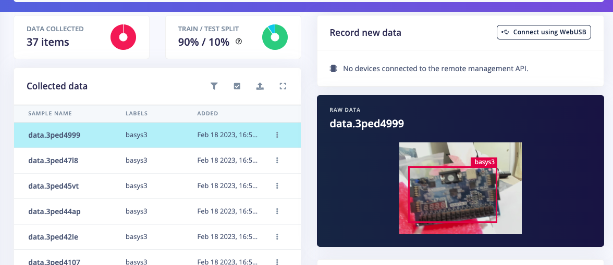
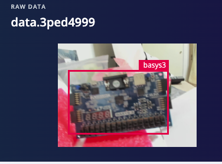
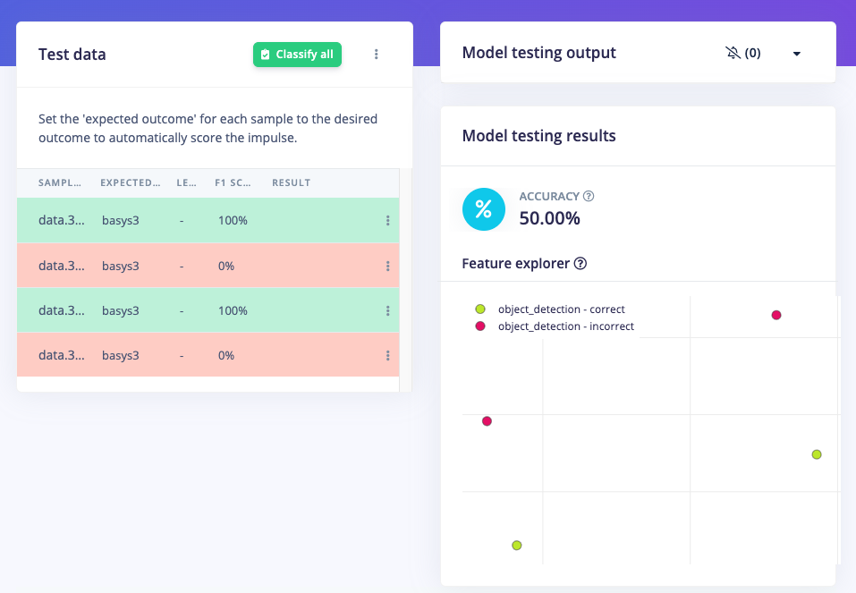
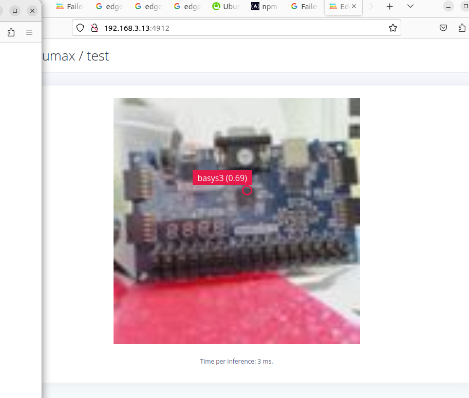

[このサイト](https://www.hackster.io/whitney-knitter/edge-impulse-on-kria-kr260-ed12bc)
を参考にして、自前のBasys3を学習させて、認識できるようにやってみた。

必要なもの、こと
- Kria KR260 x 1
- USBカメラ(ロジクールBRIO) x 1
- Edge Impluseのアカウント登録
- MicroSDカード x 1

AMDのサイトに行って、Kria KR260用のubuntuをダウンロードしてMicroSDカードに焼く。
https://www.xilinx.com/products/som/kria/kr260-robotics-starter-kit/kr260-getting-started/booting-your-starter-kit.html

Kria KR260にMicroSDカードをさして、起動。

edge impluse用のパッケージをインストール。

edge impluseのサイトにログインして、training、test用の画像を撮影。
　全体で、41枚撮影して、training用に37枚、test用に4枚使いました。

撮影した画像にlabelingしていきます。今回は、Basys３を認識させたいので
Basys3の写っている範囲を指定しています。

精度を確認したところ、50％ぐらいでした。今回はとりあえず動かしたかったので
追加でtraining画像を増やしたりしませんでした。

Kria KR260でedge impulseを実行した結果以下の図のように上手いことbasys3に
カメラを向けると認識してくれます。

今回は精度が50%でしたが、もっと良くするためにいろんな角度の画像を撮影した方がいいです。
（今回はほぼ正面の画像のみ）